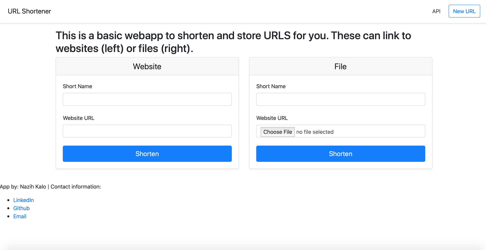

# URL Shortener 

[CHECK IT OUT!](http://nazihkalo.pythonanywhere.com )

## Implemented Basic Flask web application that allows you to create local url shortcuts to your favorite websites and/or files. 

## The app uses cookies to keep track of your saved links.

